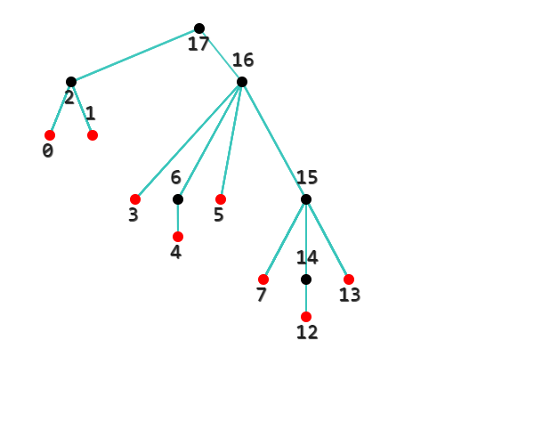

# 概述

这是一个用 HTML5 和 Javascript 实现的树形图生成器。要求的输入文件为 JSON 格式，图形会静态地显示在浏览器中。

这段代码简短易懂，你可以扩充它或者将它移植到其他语言，如果你这么做了，请告诉我。



# 用法

## 第一步

在 `index.html` 所在目录下添加 `tree.js` 文件。

`tree.js` 文件应该有如下格式：

```js
// tree 是一个数组
const tree = [
	{
		// val 的值会显示在结点旁边
		val: "A", 
		
		// children 数组记录子结点
		// 也就是说
		// tree[1] 和 tree[2] 都是 tree[0] 的子结点
		children: [1, 2]
	},
	{
		val: "B",
		children: [3]
	},
	{
		val: "C",
		children: []
	},
	{
		val: "D",
		children: []
	}
]

// root 是一个数组
// root[0] 应为根结点的引用
// 程序只使用 root[0] 中的值
const root = [tree[0]]
```

## 第二步

用浏览器打开文件 `index.html`。要求浏览器支持 HTML5 的 canvas 特性（最近两年内的浏览器都可以）。树形图会显示在页面上。然后你可以展示、截图。也可以右击图像然后把它保存为图像文件。

# 常见问题

## 没有图像显示/图像显示不全

你可能需要上下左右滚动页面或者缩小页面才能看到完整图像。

在文件 `index.html` 里面修改元素 `myCanvas` 的长度和宽度，它决定了绘图区的大小。`myCanvas` 过大时，浏览器会停止工作。

在文件 `config.js` 里面修改 `ORIGIN` 的值，它决定了树形图在页面上的位置。

你可以打开浏览器的控制台，查看 `root[0].x` 及 `root[0].y` 来确定根结点的当前坐标。

## 我想改大小、颜色、字体、字号、间距、图像位置/我想关闭文本显示

都在文件 `config.js` 里面。

## 我可以在表示结点的对象中加入其他属性/方法吗？

可以。但是不要加入下列属性，因为下列属性被程序占用了：

```
x
y
seg
offset
```

也就是说，`tree` 数组中的对象实际上是下面这样的：

```js
{
	val:		/* something */,
	children:	/* something */,
	x:		/* something */,
	y:		/* something */,
	seg:		/* something */,
	offset:		/* something */
}
```

## `val` 只能是字符串吗？

`val` 可以是任意类型。程序最终会使用 toString 方法来将 `val` 转换为字符串。


# 已知问题

- 绘制的边透明度不正确。<s>也许是因为重复绘制了某些边。</s>

# 贡献者

我
